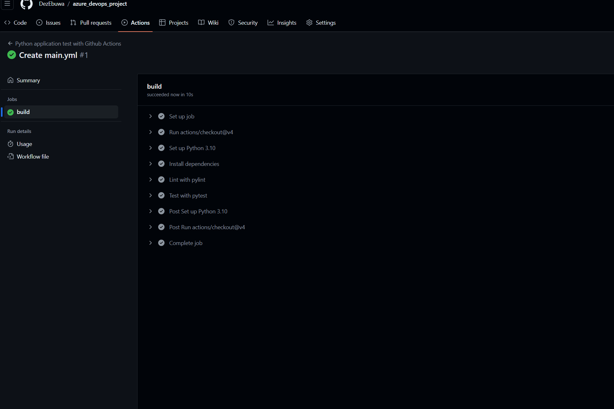
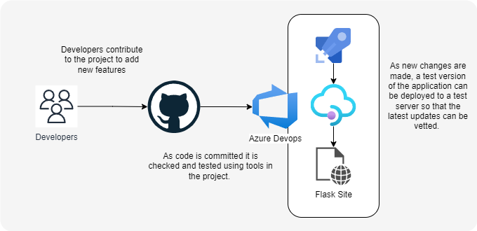
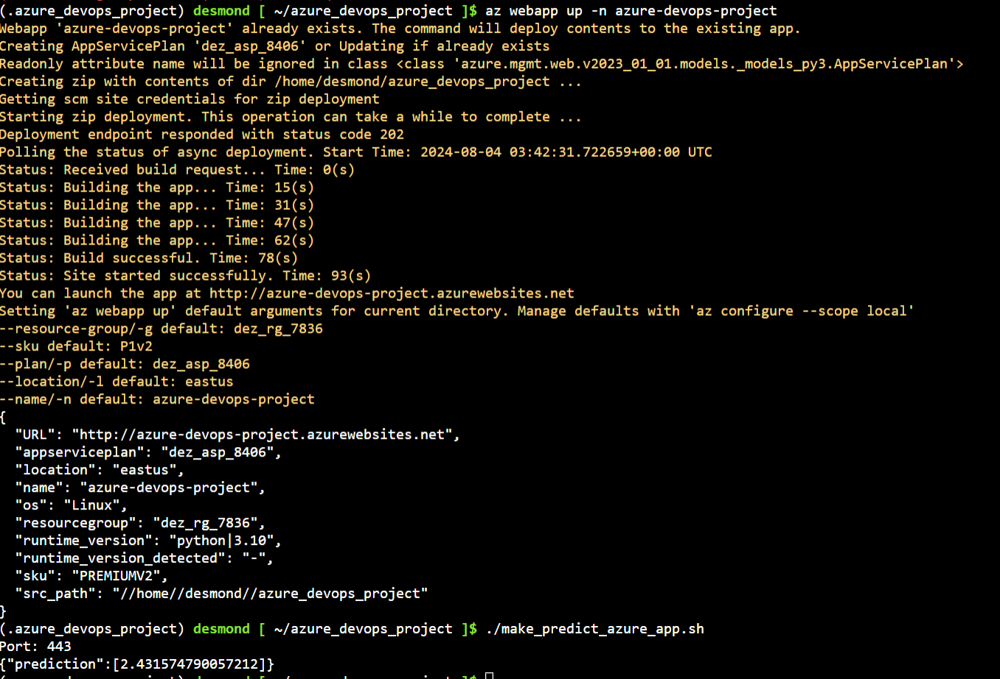

# Azure Devops Project by Desmond Ebuwa

Project for Agile Development with Azure



## Overview

This project involves the setup and deployment of a web app using Azure Devops, Github, Azure Cloud Shell, Python, and some supporting tools. In the end you will have a functioning web application that you can run tests against and update using automation. 

## Project Plan
* https://trello.com/invite/b/66aeaeca82e7f6812922f2a2/ATTIf58b3a5f5f9505ec41be2a64cae735b1A7DC4277/azuredevopsproject
* https://docs.google.com/spreadsheets/d/1-G759TPuaPf2eVXYCO-W9VpOprBsu_b8Giy68L7vMLs/edit?usp=sharing

## Instructions




* Project running on Azure App Service
	1. Log in to your Azure DevOps account. https://dev.azure.com
	2. Create an organization if one does not already exist
	3. Create a project in that organization.
	4. Create a new pipeline. 
	5. Connect that pipeline to your GitHub project

* Project cloned into Azure Cloud Shell
	1. Log in to the Azure Portal.
	2. in the top bar4(in blue) access the cloud shell. 
	3. in the cloud shell generate a new ssh key to add to your github account. 
	   ```
	   # ssh-keygen -t rsa
	   ```
	4. Clone the repo to your shell vm
		```
		# git clone <your repo url>
		```
	5. Set up virtual environment for python
	```
	  # python3 -m venv ~/.azure_devops_project#
	  # source ~/.azure_devops_project/bin/activate
	```
	6. Run the tasks in the Makefile
	``` 
	   # make all 
	```
	   

After running `make all`, make will start to execute its tasks by installing requirements. 
```
(.azure_devops_project) desmond [ ~/azure_devops_project ]$ make install
pip install --upgrade pip &&\
        pip install -r requirements.txt
Requirement already satisfied: pip in /home/desmond/.azure_devops_project/lib/python3.9/site-packages (24.2)
Requirement already satisfied: flask==3.0.3 in /home/desmond/.azure_devops_project/lib/python3.9/site-packages (from -r requirements.txt (line 1)) (3.0.3)
Requirement already satisfied: pandas==2.2.2 in /home/desmond/.azure_devops_project/lib/python3.9/site-packages (from -r requirements.txt (line 2)) (2.2.2)
Requirement already satisfied: scikit-learn==1.5.1 in /home/desmond/.azure_devops_project/lib/python3.9/site-packages (from -r requirements.txt (line 3)) (1.5.1)
Requirement already satisfied: joblib==1.4.2 in /home/desmond/.azure_devops_project/lib/python3.9/site-packages (from -r requirements.txt (line 4)) (1.4.2)
Requirement already satisfied: pylint==3.2.6 in /home/desmond/.azure_devops_project/lib/python3.9/site-packages (from -r requirements.txt (line 5)) (3.2.6)
Requirement already satisfied: pytest==8.3.1 in /home/desmond/.azure_devops_project/lib/python3.9/site-packages (from -r requirements.txt (line 6)) (8.3.1)
Requirement already satisfied: Werkzeug>=3.0.0 in /home/desmond/.azure_devops_project/lib/python3.9/site-packages (from flask==3.0.3->-r requirements.txt (line 1)) (3.0.3)
Requirement already satisfied: Jinja2>=3.1.2 in /home/desmond/.azure_devops_project/lib/python3.9/site-packages (from flask==3.0.3->-r requirements.txt (line 1)) (3.1.4)
Requirement already satisfied: itsdangerous>=2.1.2 in /home/desmond/.azure_devops_project/lib/python3.9/site-packages (from flask==3.0.3->-r requirements.txt (line 1)) (2.2.0)
Requirement already satisfied: click>=8.1.3 in /home/desmond/.azure_devops_project/lib/python3.9/site-packages (from flask==3.0.3->-r requirements.txt (line 1)) (8.1.7)
Requirement already satisfied: blinker>=1.6.2 in /home/desmond/.azure_devops_project/lib/python3.9/site-packages (from flask==3.0.3->-r requirements.txt (line 1)) (1.8.2)
Requirement already satisfied: importlib-metadata>=3.6.0 in /home/desmond/.azure_devops_project/lib/python3.9/site-packages (from flask==3.0.3->-r requirements.txt (line 1)) (8.2.0)
Requirement already satisfied: numpy>=1.22.4 in /home/desmond/.azure_devops_project/lib/python3.9/site-packages (from pandas==2.2.2->-r requirements.txt (line 2)) (2.0.1)
Requirement already satisfied: python-dateutil>=2.8.2 in /home/desmond/.azure_devops_project/lib/python3.9/site-packages (from pandas==2.2.2->-r requirements.txt (line 2)) (2.9.0.post0)
Requirement already satisfied: pytz>=2020.1 in /home/desmond/.azure_devops_project/lib/python3.9/site-packages (from pandas==2.2.2->-r requirements.txt (line 2)) (2024.1)
Requirement already satisfied: tzdata>=2022.7 in /home/desmond/.azure_devops_project/lib/python3.9/site-packages (from pandas==2.2.2->-r requirements.txt (line 2)) (2024.1)
Requirement already satisfied: scipy>=1.6.0 in /home/desmond/.azure_devops_project/lib/python3.9/site-packages (from scikit-learn==1.5.1->-r requirements.txt (line 3)) (1.13.1)
Requirement already satisfied: threadpoolctl>=3.1.0 in /home/desmond/.azure_devops_project/lib/python3.9/site-packages (from scikit-learn==1.5.1->-r requirements.txt (line 3)) (3.5.0)
Requirement already satisfied: platformdirs>=2.2.0 in /home/desmond/.azure_devops_project/lib/python3.9/site-packages (from pylint==3.2.6->-r requirements.txt (line 5)) (4.2.2)
Requirement already satisfied: astroid<=3.3.0-dev0,>=3.2.4 in /home/desmond/.azure_devops_project/lib/python3.9/site-packages (from pylint==3.2.6->-r requirements.txt (line 5)) (3.2.4)
Requirement already satisfied: isort!=5.13.0,<6,>=4.2.5 in /home/desmond/.azure_devops_project/lib/python3.9/site-packages (from pylint==3.2.6->-r requirements.txt (line 5)) (5.13.2)
Requirement already satisfied: mccabe<0.8,>=0.6 in /home/desmond/.azure_devops_project/lib/python3.9/site-packages (from pylint==3.2.6->-r requirements.txt (line 5)) (0.7.0)
Requirement already satisfied: tomlkit>=0.10.1 in /home/desmond/.azure_devops_project/lib/python3.9/site-packages (from pylint==3.2.6->-r requirements.txt (line 5)) (0.13.0)
Requirement already satisfied: typing-extensions>=3.10.0 in /home/desmond/.azure_devops_project/lib/python3.9/site-packages (from pylint==3.2.6->-r requirements.txt (line 5)) (4.12.2)
Requirement already satisfied: dill>=0.2 in /home/desmond/.azure_devops_project/lib/python3.9/site-packages (from pylint==3.2.6->-r requirements.txt (line 5)) (0.3.8)
Requirement already satisfied: tomli>=1.1.0 in /home/desmond/.azure_devops_project/lib/python3.9/site-packages (from pylint==3.2.6->-r requirements.txt (line 5)) (2.0.1)
Requirement already satisfied: iniconfig in /home/desmond/.azure_devops_project/lib/python3.9/site-packages (from pytest==8.3.1->-r requirements.txt (line 6)) (2.0.0)
Requirement already satisfied: packaging in /home/desmond/.azure_devops_project/lib/python3.9/site-packages (from pytest==8.3.1->-r requirements.txt (line 6)) (24.1)
Requirement already satisfied: pluggy<2,>=1.5 in /home/desmond/.azure_devops_project/lib/python3.9/site-packages (from pytest==8.3.1->-r requirements.txt (line 6)) (1.5.0)
Requirement already satisfied: exceptiongroup>=1.0.0rc8 in /home/desmond/.azure_devops_project/lib/python3.9/site-packages (from pytest==8.3.1->-r requirements.txt (line 6)) (1.2.2)
Requirement already satisfied: zipp>=0.5 in /home/desmond/.azure_devops_project/lib/python3.9/site-packages (from importlib-metadata>=3.6.0->flask==3.0.3->-r requirements.txt (line 1)) (3.19.2)
Requirement already satisfied: MarkupSafe>=2.0 in /home/desmond/.azure_devops_project/lib/python3.9/site-packages (from Jinja2>=3.1.2->flask==3.0.3->-r requirements.txt (line 1)) (2.1.5)
Requirement already satisfied: six>=1.5 in /home/desmond/.azure_devops_project/lib/python3.9/site-packages (from python-dateutil>=2.8.2->pandas==2.2.2->-r requirements.txt (line 2)) (1.16.0)
```




## Enhancements

I think the biggest improvement to this demo would be to use fewer tools. Most every ttool needed is in Azure Devops. There is no reason to use Trello or excel. 

## Demo 

[<Demo Video>](https://youtu.be/9iCYIsHgi4o)
